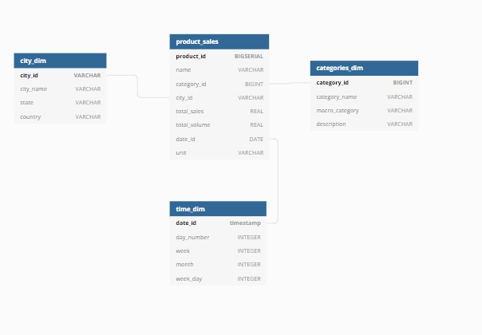
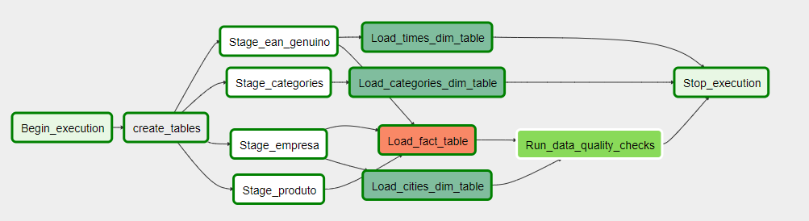

# Udacity Data Engineering Nanodegree - Project 6: Capstone Data Pipelines

## Description

Horus is a brazilian startup that creates final user shopping behaviour reports related to the retail market. The company gathers its data using their price comparisson app, Pinngo.

This app helps consumers to find the cheapest prices in the supermarkets around them, seeing updated information in almost every category and segment. To achieve that Pinngo relies in the user collaboration,
as the end user scans the QR code present in supermarket bill receipts in Brazil and upload all the prices to the platform, helping other users to see more updated information.

With millions of products data everyday, Horus is able to understand the retail market in Brazil almost in real time, helping companies to address strategic decisions, in various department such as marketing, operations, sales and how to increase their market share.


## Data sources and staging

The data used in this project is a subset of the original Pinngo app data.  We will use a 7 days window of product sales from users across Brazil, the database of products from Horus,
a dataset from Nielsen with market categories this one in JSON format), and a dataset of supermarket companies information.

For this project, the pinngo data is stored in S3, with the invoice infomation being partioned in csv for every day (a full day of data contains around 6 millions rows).

The four datasets stored in S3 and are going to be copied from there to Redshift to be used as staging tables.

The stage tables in Redshit have the following structure:

_*Datbase schema close up to stage tables.*_

## Database design
The question the company's business analyts needs to answer is how many unique product sales where made in one day, by city, and state. 

For answering that,  the source data provided by the Pinngo app will be transformed in a starc schema, with the fact table being a sale of a single product.

Associated with this fact table will be information regarding the city, collected by the company information in the invoice, the category of the product (to provide slices for this kind of analysis) and a time information.

The final data is aggregated by day, as the analyts and Horus do not measure intraday variations.

The database designed implements a star schema, with 1 fact table and 3 dimensions. Our fact table `product_sales` is the total sales of a product by city, meanwhile the dimensions are:
* `categories` - Contains product category information such as meat, fruits, sweets, beverage....
* `time` - Contains dates only without the timestamp information
* `city` - Contains cities information such as city code, state, and country
 

_*Datbase schema close up to final tables.*_


### Final model data dictionary

Categories dimension:


Cities dimension:


Time dimension:


Product Sales Fact:


## Technical implementation: Airflow and Redshift

Apache Airflow, alongside with a Redshift data warehouse cluster were the technology choices for this project.

Airflow provides a powerful tool for the ELT process, alowing a quick monitoring and , with the user of custom operators and connectors, the capability of connecting to various sources in a single framework.

Amazon redshift is a columnar distirbuted database that provides robustness and perfomance to a data warehouse. The infrastructure could be used to host several datamarts and other analytics tools that the company will build in the future.

## Airflow DAG structure:
The dag implemented creates all the necessary tables at the first stage, moving to stage of staging data from S3 to redshift. 

A custom operator was created with the possibility to template the `s3_key` attribute, as the files containing all the products invoice of a day are organized by the date of export.

After finishing the staging, it will start to load the dimensions and fact tables into redshift. The `city` and `categories` dimensions depends on their similar table at staging level.

The fact table depends on other 3 tables to be loaded, they are the `product` stage table, `company report` and the invoice receipts table.

After loading each of the facts and dimensions, a data quality is perfomed in fact table `product_sales`, in order to confirm that all the products have their unique ID filled, as this will be necessary to associate their data with a company report.

Also, a second test will be applied in the same fact table, any product present in the table of sales should have their sales quantity and volume greater than or equal to 0 at least. 

Below we have the dag structure:


_*Airflow Dag.*_


## Example query and final data model check:

To ensure that the kind of analysis requested by the business team is possible with this data model, the following query was executed:
```
/* All product sales by category and state */
SELECT cd.category_name, cd2.state,SUM(total_sales) as Total_Sales, SUM(total_volume) as Total_Volume, ps.unit 
FROM product_sales ps LEFT JOIN categories_dim cd 
ON ps.category_id = cd.category_id
JOIN city_dim cd2 ON  ps.city_id= cd2.city_id
GROUP BY cd.category_name, cd2.state,  ps.unit
ORDER BY cd.category_name, cd2.state

```

And the result was as expected:

## Scenarios study

* The data was increased by 100x: The increase in the data would not be a problem, the current pipeline is daily and finishes to run with 6 million lines in less than 30 minutes However, if still necessary, the cluster capacity could be increased in AWS and the airflow workers scalled using kubernets.
* The pipelines would be run on a daily basis by 7 am every day: It is already addressed in the current pipeline
* The database needed to be accessed by 100+ people: Amazon Redshift already have the capability to scale on demand as mentioned before. Also, to optmize the current setup, the fact table city_id column could be used as a distribution column. Considered that prices and sales volume are usually compared within a location.


## Files Structure

* `udac_dag.py` - DAG setup
* `create_tables.sql` - contains the SQL queries used to create the required tables in Redshift
* `sql_queries.py` - contains the SQL queries used in the ETL process. It should be placed in the `plugins/helpers` directory of your Airflow installation.

For this project, personalized operators were created and they need to be placed in the `plugins/operators` directory of your Airflow installation:
* `stage_redshift.py` - `StageToRedshiftOperator` Copy JSON data from S3 to staging tables in the Redshift.
* `load_dimension.py` - `LoadDimensionOperator` Setup a dimension table from staging table data.
* `load_fact.py` -  `LoadFactOperator` Setup a fact table from staging table data.
* `data_quality.py` - `DataQualityOperator` Run data quality checks passing a list of SQL queries and expected results, it will fail if the results don't match.

## Configuration

* Make sure to add the following Airflow connections:
    * `aws_credentials` - Configure this Amazon Web Services connector with your access key and secret.
    * `redshift` - Connection to the redshift cluster using the Postgres connector.